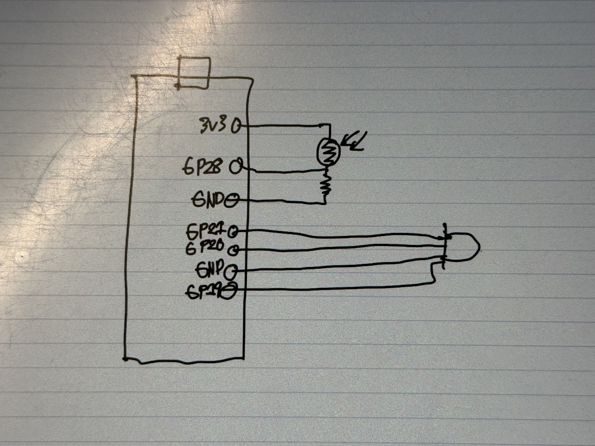

# 2025 Fall ECE Senior Design Miniproject

In this branch, I added two picture files of the circuit wired up to the raspberry pico and the schematic for it.

[Project definition](./Project.md)

This project uses the Raspberry Pi Pico 2WH SC1634 (wireless, with header pins).

Each team must provide a micro-USB cable that connects to their laptop to plug into the Pi Pico.
The cord must have the data pins connected.
Splitter cords with multiple types of connectors fanning out may not have data pins connected.
Such micro-USB cords can be found locally at Microcenter, convenience stores, etc.
The student laptop is used to program the Pi Pico.
The laptop software to program and debug the Pi Pico works on macOS, Windows, and Linux.

This miniproject focuses on using
[MicroPython](./doc/micropython.md)
using
[Thonny IDE](./doc/thonny.md).
Other IDE can be used, including Visual Studio Code or
[rshell](./doc/rshell.md).

## Hardware

* Raspberry Pi Pico WH [SC1634](https://pip.raspberrypi.com/categories/1088-raspberry-pi-pico-2-w) (WiFi, Bluetooth, with header pins)
* Freenove Pico breakout board [FNK0081](https://store.freenove.com/products/fnk0081)
* Piezo Buzzer SameSky CPT-3095C-300
* 10k ohm resistor
* 2 [tactile switches](hhttps://www.mouser.com/ProductDetail/E-Switch/TL59NF160Q?qs=QtyuwXswaQgJqDRR55vEFA%3D%3D)

### Photoresistor details

The photoresistor uses the 10k ohm resistor as a voltage divider
[circuit](./doc/photoresistor.md).
The 10k ohm resistor connects to "3V3" and to ADC2.
The photoresistor connects to the ADC2 and to AGND.
Polarity is not important for this resistor and photoresistor.

The MicroPython
[machine.ADC](https://docs.micropython.org/en/latest/library/machine.ADC.html)
class is used to read the analog voltage from the photoresistor.
The `machine.ADC(id)` value corresponds to the "GP" pin number.
On the Pico W, GP28 is ADC2, accessed with `machine.ADC(28)`.

### Piezo buzzer details

PWM (Pulse Width Modulation) can be used to generate analog signals from digital outputs.
The Raspberry Pi Pico has eight PWM groups each with two PWM channels.
The [Pico WH pinout diagram](https://datasheets.raspberrypi.com/picow/PicoW-A4-Pinout.pdf)
shows that almost all Pico pins can be used for multiple distinct tasks as configured by MicroPython code or other software.
In this exercise, we will generate a PWM signal to drive a speaker.

GP16 is one of the pins that can be used to generate PWM signals.
Connect the speaker with the black wire (negative) to GND and the red wire (positive) to GP16.

In a more complete project, we would use additional resistors and capacitors with an amplifer to boost the sound output to a louder level with a bigger speaker.
The sound output is quiet but usable for this exercise.

Musical notes correspond to particular base frequencies and typically have rich harmonics in typical musical instruments.
An example soundboard showing note frequencies is [clickable](https://muted.io/note-frequencies/).
Over human history, the corresspondance of notes to frequencies has changed over time and location and musical cultures.
For the question below, feel free to use musical scale of your choice!

[Music Examples](https://github.com/twisst/Music-for-Raspberry-Pi-Pico/blob/main/play.py)

---
## HTTP API Endpoints

### GET
- **`/health`**
  - Returns device health info:
    ```json
    {
      "status": "ok",
      "device_id": "<DEVICE_ID>",
      "api": "1.0.0"
    }
    ```

- **`/sensor`**
  - Returns light sensor readings:
    ```json
    {
      "raw": 12345,
      "norm": 0.188,
      "lux_est": 37.6
    }
    ```

- **`/led`**
  - Blinks the LED **once** (white for 0.3s, then off).
  - Response:
    ```json
    {
      "blink": "done"
    }
    ```

### POST
- **`/tone`**
  - Plays a single tone on the buzzer.
  - Request body:
    ```json
    {
      "freq": 440,
      "ms": 500,
      "duty": 0.5
    }
    ```
  - Response:
    ```json
    {
      "playing": true,
      "until_ms_from_now": 500
    }
    ```

- **`/melody`**
  - Plays a sequence of tones (melody).
  - Request body:
    ```json
    {
      "notes": [
        {"freq": 440, "ms": 300},
        {"freq": 494, "ms": 300}
      ],
      "gap_ms": 20
    }
    ```
  - Response:
    ```json
    {
      "queued": 2
    }
    ```

- **`/led`**
  - Blinks the LED **red 5 times** (0.3s on/off each).
  - Response:
    ```json
    {
      "led_blink": "red 5 times"
    }
    ```
---
## Designs and Changes in Design
The baord was wired accordingly to the wiring diagram with a 10k ohm resistor. Our first design simply played a tone from the program to the board. Then, the design improved when the board was able to react to changes in luminence. The project was tweaked when we connected the device to the network and then the final design integrated the LED onto the board as well.



## Testing
The first test was to make sure that the Raspberry Pi board could be succesfully connected to the device. We successfully connected the Raspberry Pi board to the device through Visual Studio Code. After we connected the device, sound was playing from the board which let us know that the board was running the program. Then, using the webserver.py file, the board became connected to the WiFi and we tested the functionality by shining light on the sensor and seeing the luminence values increase. The led.py file was used to test the connection of the LED and the LED colors were shown. The photoresistor test file was utilized to test the mapping between luminence and tone where the tone decreases with luminence. By shining a light on the sensor, we saw the tone increase and the opposite effect when there wasn't a light on the sensor. Through these sets of test and testing files, we were able to determine if our mini project was successful and performing testing throughout the design process made it easier to pinpoint problems that we encountered. 
## Notes

Pico MicroPython time.sleep() doesn't error for negative values even though such are obviously incorrect--it is undefined for a system to sleep for negative time.
Duty cycle greater than 1 is undefined, so we clip the duty cycle to the range [0, 1].


## Reference

* [Pico 2WH pinout diagram](https://datasheets.raspberrypi.com/picow/pico-2-w-pinout.pdf) shows the connections to analog and digital IO.
* Getting Started with Pi Pico [book](https://datasheets.raspberrypi.com/pico/getting-started-with-pico.pdf)
* [Setting up Pico for with VSCode IDE](https://www.raspberrypi.com/news/get-started-with-raspberry-pi-pico-series-and-vs-code/) to wotk in a comfortable environment.

